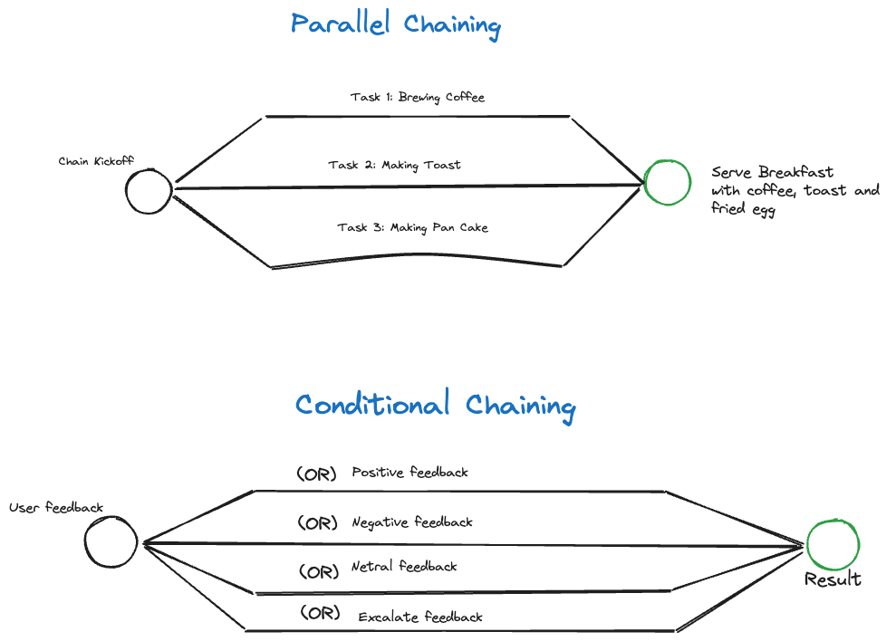

## Types of Chains
1. LLMChain :
- Combines a prompt with a language model
- Allows you to generate responses based on user input



## Langchain Utility Tools
1. RunnableLambda :
- A utility that lets you wrap Python functions into LangChain's runnable interface
- Useful for adding custom processing steps in your chain

```python
format_prompt = RunnableLambda(lambda x: prompt_template.format(**x))
# send the formatted prompt to the language model (LLM).
# Modify the invoke_llm to handle string input correctly
invoke_llm = RunnableLambda(lambda x: llm.invoke([{"role": "user", "content": x}]))
# extract the content from the LLM's response
parse_output = RunnableLambda(lambda x: x.content)

```

2. RunnableSequence :
- Allows you to create a sequence of operations that run in order
- Each step's output becomes the input for the next step
- Similar to the pipe operator ( | ) but with more control

```python
chain = RunnableSequence(first=format_prompt, middle=[invoke_llm], last=parse_output)
```

These components are particularly useful when you need to:
- Add custom processing steps in your LangChain pipeline
- Transform data between different chain components
- Create complex workflows with multiple steps
- Handle intermediate data processing


