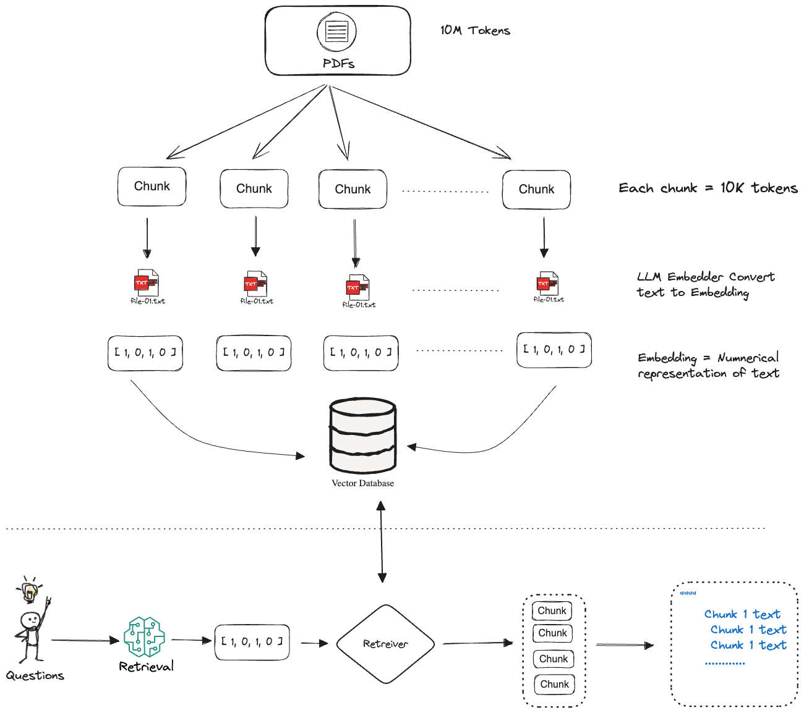

# Concept
## 1. Retrieval Augmented Generation (RAGs)

RAGs is a technique that combines retrieval and generation to generate high-quality responses to user queries. It involves the following steps:
1. Retrieval: RAGs retrieves relevant information from a knowledge base or external sources based on the user's query. This step can be done using various retrieval techniques such as keyword search, semantic search, or machine learning models.
2. Generation: RAGs generates a response to the user's query using the retrieved information. This step can be done using various generation techniques such as language modeling, machine translation, or neural network models.

The main advantage of RAGs is that it can generate high-quality responses to user queries even if the user's query is not present in the knowledge base or external sources. This is because RAGs can retrieve relevant information from the knowledge base or external sources and generate a response based on that information.

The Problems that RAGs solves are:
1. Information overload: RAGs can help users find the information they need more quickly and efficiently.
2. Out-of-domain queries: RAGs can help users find information even if the user's query is not present in the knowledge base or external sources.
3. Spelling and grammar errors: RAGs can help users correct spelling and grammar errors in their queries.

In other words, RAGs is a technique that combines retrieval and generation to generate high-quality responses to user queries. It can help users find the information they need more quickly and efficiently, even if the user's query is not present in the knowledge base or external sources.

```
tl;dr 
  Rags is a method where we combine LLMs with retrieval systems.

  This retrieval system can be anything from a vector database to a retrieval API. and it can search through vast sources of external information-like documents, databases, or knowldge graph - wherever the LLM needs additional knowledge to give you a better answer.

  ALl the while making sure LLMs are not overwhelm with bigger prompts.
```



### What are tokens?

- In the context of natural language processing (NLP), a token is a basic unit of text that represents a meaningful element, such as a word, a punctuation mark, or a part of a word. Tokens are the building blocks of text that are processed by NLP models.
- Tokens are crucial because LLMs have a limit on how many tokens they can process at once, often referred to as the context window. This limit is set by the model architecture and can vary depending on the model.
- This means that if we have a PDF that's 10 million tokens long, we can't pass it to the LLM as a single unit. Instead, we need to split it into smaller chunks, and then pass each chunk to the LLM separately.

### What are Embeddings?
- Embeddings are a way of representing text in a way that makes it easier for computers to understand. Embeddings are learned from the text, and they capture the meaning of the text in a way that is similar to how humans understand it.
- Mathematical representation of words, phrases, or sentences in a way that is easy for computers to understand.
- For example, the word "cat" can have a vector embedding that can look something like this: [34, 21, 7.5, -12, 14.3, ...]

### Vector Databases
- Vector databases are a type of database that stores vectors, which are mathematical representations of text or other data.
- Vector databases are optimized for handling high-dimensional data, making them ideal for storing and querying embeddings.
- They enable efficient similarity searches, which is crucial for applications like recommendation systems and semantic search.
- Vector databases can scale to handle large volumes of data, ensuring quick retrieval times even as the dataset grows.

### Chunk Overlap?
- Chunk overlap is a technique used in text processing to ensure that the chunks of text that are used to train a language model are not too dissimilar.
- Defines how many chunks of text should overlap when splitting a document into smaller chunks and should be included in both ends of one chain and the beginning of the next chain.
- By setting chunk overlap = 0, you are telling the splitter to ensure that there's no overlap between the chunks.
- If you set chunk_overlap = 100, for example, the last 100 characters of one chunk will be the same as the first 100 characters of the next chunk. This helps preserver context across chunks.

**Example:**

**Without Chunk Overlap (`chunk_overlap=0`):**

- **Chunk 1:** "Hello, how are y?"
- **Chunk 2:** "ou doing, today?"

*Problem:* The last word of Chunk 1 ("y?") is not the same as the first word of Chunk 2 ("ou"). This can lead to a loss of context.

**With Chunk Overlap (`chunk_overlap=100`):**

- **Chunk 1:** "Hello, how are you doing, today?"
- **Chunk 2:** "you doing, today?"

*Better:* The last 100 characters of Chunk 1 ("you doing, today?") are the same as the first 100 characters of Chunk 2 ("you doing, today?"). This helps preserve context.
